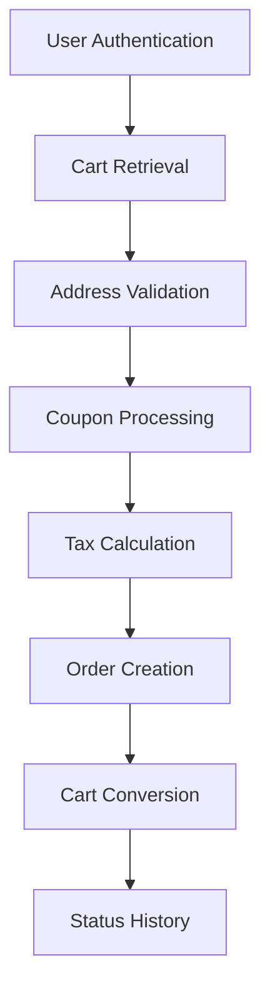

# Mankind Matrix Order Service

A microservice that manages the complete order lifecycle for the Mankind Matrix AI platform, from cart conversion to delivery tracking.

## Quick Start

- **Service Port**: 8088
- **Swagger UI**: http://localhost:8088/swagger-ui
- **API Docs**: http://localhost:8088/v3/api-docs
- **Gateway Access**: 
  - User endpoints: `/api/v1/orders/*`
  - Admin endpoints: `/api/v1/admin/orders/*`

## Core Features

| Feature | Description |
|---------|-------------|
| **Order Management** | Create, read, update, and track orders throughout lifecycle |
| **Cart Integration** | Seamless conversion from active carts to orders |
| **Smart Numbering** | Unique order numbers (ORD-YYYYMMDD-HHMMSS-XXXXX) |
| **Status Tracking** | Comprehensive order and payment status management |
| **Coupon Support** | Discount validation and application |
| **Admin Controls** | Full administrative order management capabilities |
| **Audit Trail** | Complete history of all order changes |

## Architecture Overview

### Service Dependencies
- **Cart Service** (8082): Cart retrieval and status updates
- **User Service** (8081): User authentication and address validation
- **Coupon Service** (8087): Coupon validation and usage tracking
- **Product Service** (8080): Inventory management

### Data Flow
```
Cart → Order Creation → Status Management → Delivery Tracking
  ↓           ↓              ↓                    ↓
Validation → Processing → Admin Updates → Completion
```

## Order Lifecycle

### 1. Order Creation Process



**Step-by-Step Flow:**
1. **Authentication**: Validate JWT token and get current user
2. **Cart Validation**: Ensure active cart exists and is in ACTIVE status
3. **Address Verification**: Validate shipping address ownership
4. **Coupon Application**: Process and validate discount codes
5. **Financial Calculation**: Compute subtotal, tax, discounts, shipping, and total
6. **Order Generation**: Create order with unique number and PENDING status
7. **Inventory Update**: Mark products as sold
8. **Cart Conversion**: Change cart status to CONVERTED
9. **Audit Logging**: Record all actions in status history

### 2. Order Status Flow

| Status | Description | Next Possible Status |
|--------|-------------|---------------------|
| **PENDING** | Order created, awaiting confirmation | CONFIRMED, CANCELLED |
| **CONFIRMED** | Payment verified, order confirmed | PROCESSING, CANCELLED |
| **PROCESSING** | Order being prepared for shipping | SHIPPED |
| **SHIPPED** | Order dispatched to customer | DELIVERED |
| **DELIVERED** | Order completed successfully | None (final) |
| **CANCELLED** | Order cancelled (admin only) | None (final) |

### 3. Payment Status Tracking

| Status | Description | Business Impact |
|--------|-------------|-----------------|
| **PENDING** | Payment not yet processed | Order remains in PENDING status |
| **PAID** | Payment completed successfully | Order can proceed to CONFIRMED |
| **FAILED** | Payment processing failed | Order remains in PENDING status |
| **REFUNDED** | Full refund issued | Order may be cancelled |
| **PARTIALLY_REFUNDED** | Partial refund issued | Order total adjusted |

## Financial Calculations

### Formula Breakdown
```
Subtotal = Sum of all cart items
Discounts = Total coupon savings
Tax = 10% × (Subtotal - Discounts)
Shipping = User-provided shipping cost
Total = Subtotal - Discounts + Tax + Shipping
```

### Field Descriptions
- **Subtotal**: Base amount before any modifications
- **Tax**: 10% tax applied to discounted subtotal
- **Discounts**: Total savings from applied coupons
- **Shipping**: Delivery cost (user-specified, validated)
- **Total**: Final amount customer pays

## Validation Rules

### Cart Requirements
- ✅ Must be in ACTIVE status
- ✅ Must belong to authenticated user
- ✅ Must contain at least one item

### Address Validation
- ✅ Shipping address must belong to current user
- ✅ Address must exist and be valid

### Coupon Rules
- ✅ Must be valid and not expired
- ✅ Must not exceed order value
- ✅ Can only be used once per order

### Shipping Validation
- ✅ Required field
- ✅ Must be ≥ 0
- ✅ Must not exceed 1000 (anti-fraud)

## Admin Operations

### Access Control
- **Role Required**: ADMIN or SUPER_ADMIN
- **Authentication**: JWT token validation
- **Role Verification**: Comprehensive role validation service
- **Endpoint Base**: `/api/v1/admin/orders`

### Key Capabilities

#### Advanced Filtering
| Filter Type | Example | Description |
|-------------|---------|-------------|
| **Status** | `?status=PENDING` | Filter by order status |
| **Payment** | `?paymentStatus=PAID` | Filter by payment status |
| **Order Number** | `?orderNumber=ORD-2024` | Partial match search |
| **Date Range** | `?createdAtFrom=2024-01-01T00:00:00` | ISO 8601 format |
| **Page** | `?page=0` | Page number (0-based, default: 0) |
| **Size** | `?size=20` | Page size (default: 20) |

#### Bulk Operations
- **Pagination**: Always required (prevents performance issues)
- **Default Sorting**: `createdAt` descending (newest first)
- **Fixed Sorting**: Orders are always sorted by creation date for consistency
- **Combined Filters**: Multiple filters simultaneously

#### Status Management
- **Business Rule Validation**: Enforces status transition rules
- **Audit Logging**: All changes recorded with timestamps and notes
- **Role-Based Access**: Only admins can modify order status

### Admin Business Rules

#### Status Transition Matrix
```
PENDING → CONFIRMED → PROCESSING → SHIPPED → DELIVERED
   ↓           ↓
CANCELLED   CANCELLED
```

#### Validation Rules
- **CANCELLED orders**: Cannot be modified further
- **DELIVERED orders**: Cannot be modified further
- **Status changes**: Must follow defined lifecycle
- **Admin actions**: Always logged with notes

## Performance & Security

### Performance Optimizations
- **Database Indexing**: Optimized queries for all filter combinations
- **Pagination**: Prevents memory issues with large datasets
- **Efficient Queries**: Single database call for filtered results
- **Connection Pooling**: Optimized database connections

### Security Features
- **JWT Authentication**: Secure token-based access control
- **Role-Based Access**: ADMIN role required for administrative operations
- **Role Verification Service**: Comprehensive admin role validation (ADMIN or SUPER_ADMIN)
- **Input Validation**: Comprehensive parameter validation
- **Audit Logging**: Complete trail of all administrative actions
- **Rate Limiting**: Protection against abuse

